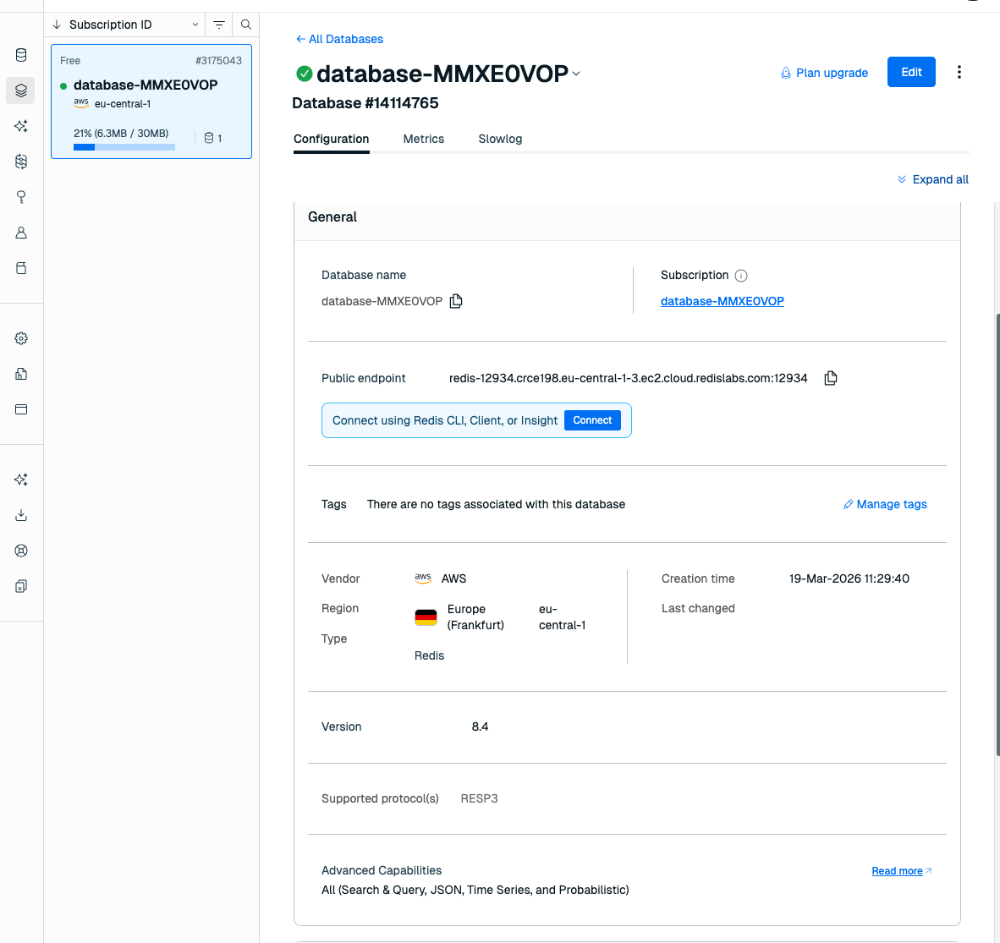
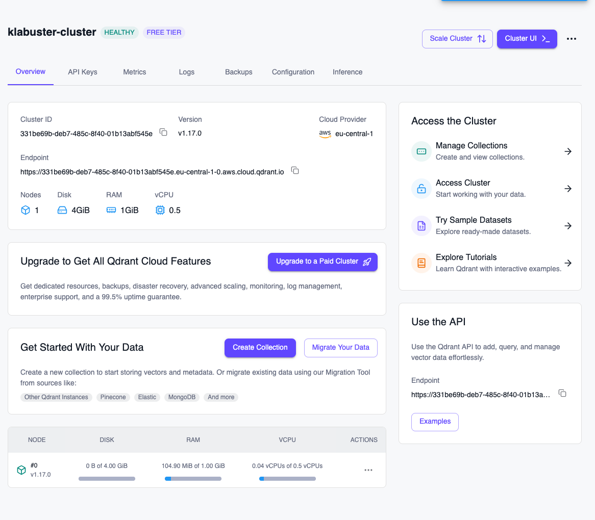
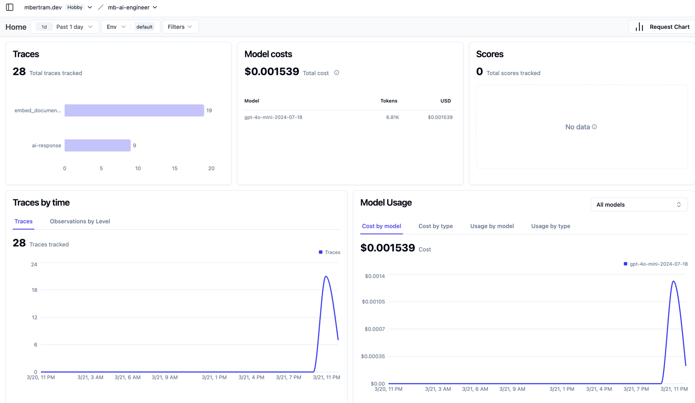
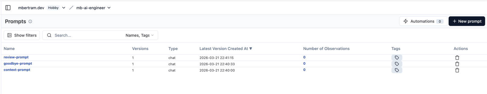
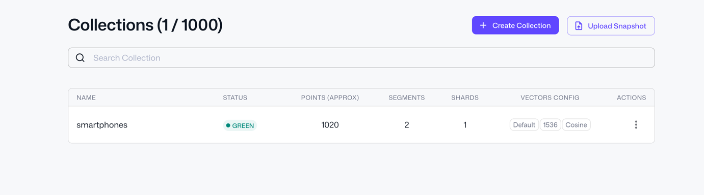
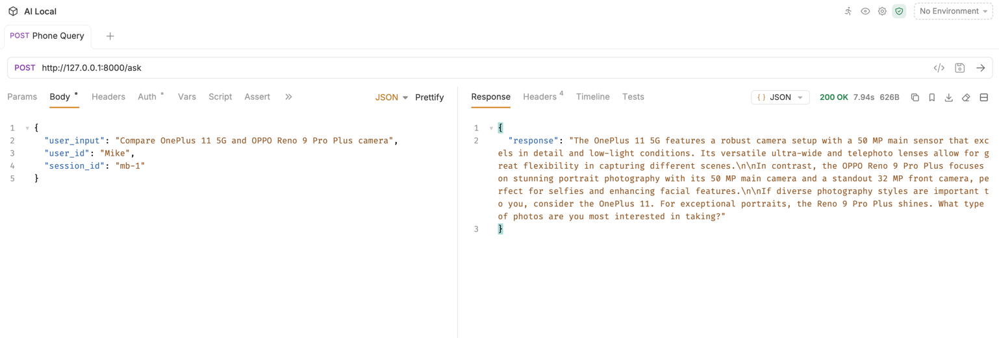
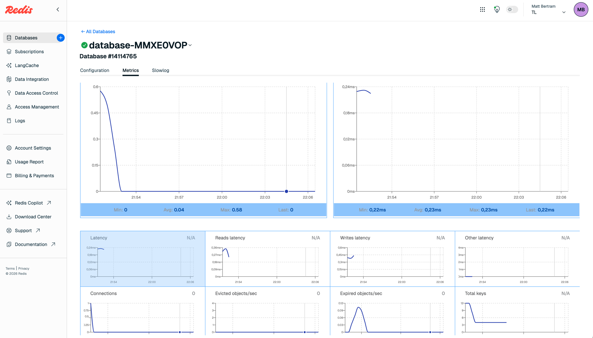
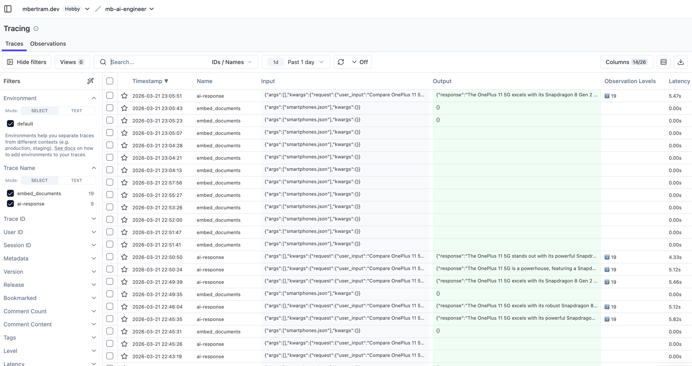

## How to run?

1. Create a virtual environment and install dependencies:
   ```bash
   pip install -r requirements.txt
   ```

2. Copy `.env.sample` to `.env` and fill in your credentials:
   ```bash
   cp .env.sample .env
   ```
   Required environment variables:
   - `REDIS_CONNECTION_STRING` - Redis connection URL for chat history
   - `OPENAI_MODEL` - Model name (e.g. `gpt-4o-mini`)
   - `OPENAI_BASE_URL` - OpenAI-compatible API base URL
   - `OPENAI_API_KEY` - API key for the LLM
   - `LANGFUSE_SECRET_KEY` / `LANGFUSE_PUBLIC_KEY` / `LANGFUSE_BASE_URL` - Langfuse credentials for tracing and prompt management
   - `QDRANT_API_KEY` / `QDRANT_URL` - Qdrant Cloud credentials for the vector store

3. Set up your prompts in Langfuse (`context-prompt` and `review-prompt`).

4. Start the server:
   ```bash
   python uvicorn main:app --reload
   ```
   The API will be available at `http://localhost:8000`.

5. Send a POST request to `/ask`:
   ```bash
   curl --request POST \
      --url http://127.0.0.1:8000/ask \
      --header 'content-type: application/json' \
      --data '{
     "user_input": "COnePlus 11 5G and OPPO Reno 9 Pro Plus cameras",
     "user_id": "Matthias",
     "session_id": "cloudsession-1"
      }'
   ```

## Screenshots

### Redis Database



### Qdrant Cluster



### Langfuse Dashboard



### Langfuse Prompts



### Qdrant Collections



### API Request - First Query



### Redis Monitoring



### Langfuse Tracing


