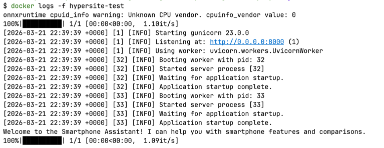

## How to run?

The Dockerfile uses a multi-stage build. The first stage installs build dependencies and Python packages into a virtual
environment. The second stage copies only the virtual environment into a clean              
python:3.13-slim image, keeping build tools out of the final image. The application runs as a non-root user with
Gunicorn and Uvicorn workers.

1. Build the Docker image:
   ```bash
   docker build -t hypersite:latest .
   ```

2. Start the container:
   ```bash
   docker run --rm --env-file .env -p 8000:8000 -d --name hypersite-test hypersite:latest
   ```

3. The API will be available at `http://localhost:8000`.

## Screenshots



The Gunicorn server starting inside the Docker container with 2 Uvicorn workers and accepts requests on port 8000.
