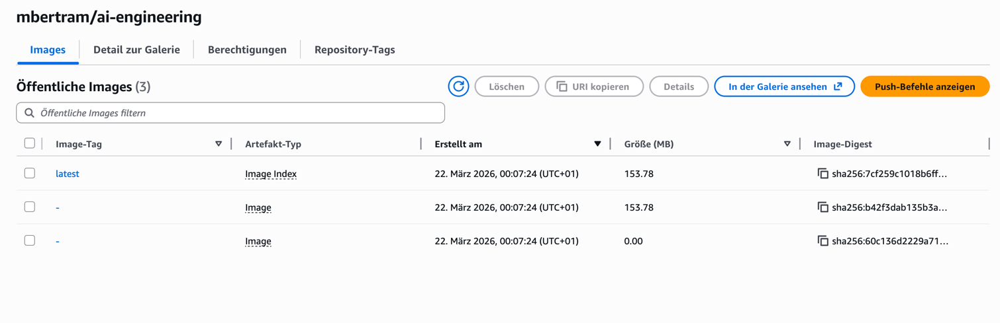

## Deployment to AWS EC2

**Service available under http://18.156.155.185/ask***

Public repo available here: `public.ecr.aws/z3h5b8b8/mbertram/ai-engineering:latest`

### ECR Repository


The Docker image pushed to Amazon ECR public repository, ready to be pulled on the EC2 instance.

```
docker buildx build --platform linux/amd64 -t mbertram/ai-engineering .
docker tag mbertram/ai-engineering:latest 536139345886.dkr.ecr.eu-central-1.amazonaws.com/mbertram/ai-engineering:latest
docker tag mbertram/ai-engineering:latest public.ecr.aws/z3h5b8b8/mbertram/ai-engineering:latest
```

### Configure Docker and pull the image on EC2

```bash
sudo groupadd docker
sudo usermod -aG docker $USER
newgrp docker
sudo dnf install docker
sudo systemctl start docker.service
sudo systemctl enable --now docker.service
docker pull public.ecr.aws/z3h5b8b8/mbertram/ai-engineering:latest
```

### Create the .env file

```bash
vi .env

REDIS_CONNECTION_STRING=<>
OPENAI_MODEL=gpt-4o-mini
OPENAI_BASE_URL=https://litellm.aks-hs-prod.int.hyperskill.org/openai
OPENAI_API_KEY=<>
LANGFUSE_SECRET_KEY=<>
LANGFUSE_PUBLIC_KEY=<>
LANGFUSE_BASE_URL=<>
QDRANT_API_KEY=<>
QDRANT_URL=<>
```

### Start the container

```bash
docker run -d -p 80:8000 --name hypersite --restart always --env-file ./.env public.ecr.aws/z3h5b8b8/mbertram/ai-engineering:latest
```

### Test service on EC2


```bash
curl --request POST \
  --url http://18.156.155.185/ask \
  --header 'content-type: application/json' \
  --data '{
    "user_input": "Compare OnePlus 11 5G and OPPO Reno 9 Pro Plus",
    "user_id": "Matthias",
    "session_id": "cloud-1"
  }'
```

Response:
```json
{
  "response": "Sure, Matthias! \n\nThe OnePlus 11 5G offers powerful performance with its Snapdragon 8 Gen 2 processor and a robust 12 GB RAM, ensuring smooth multitasking and gaming. Its 6.7-inch 1440p display with a 120 Hz refresh rate provides stunning visuals and responsiveness. The 5000 mAh battery with 100W fast charging means you'll spend less time tethered to a charger.\n\nIn contrast, the OPPO Reno 9 Pro Plus excels with its camera capabilities, making it ideal for photography enthusiasts. If camera quality and design are more important to you, the Reno may be appealing. Confirm your priorities to help make the right choice!"
}
```
