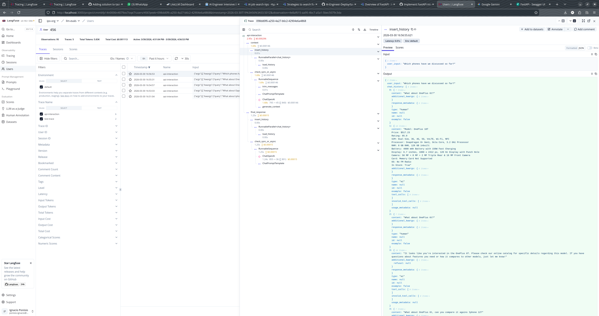
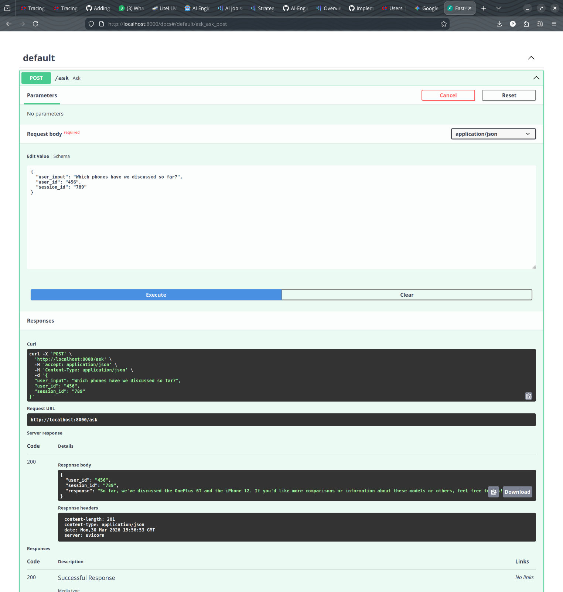

# AI Engineer Deploy - Setup and Run Instructions

## Prerequisites

- Python 3.12+
- [uv](https://docs.astral.sh/uv/) package manager
- Docker and Docker Compose (for Langfuse, Qdrant, and Redis)

## 1. Environment Setup

Copy the environment template and fill in your credentials:

```bash
cp .env.template .env
```

Edit `.env` with your values:

```
OPENAI_MODEL=gpt-4o-mini
OPENAI_BASE_URL=<your-openai-base-url>
OPENAI_API_KEY=<your-api-key>
LANGFUSE_SECRET_KEY=<your-langfuse-secret-key>
LANGFUSE_PUBLIC_KEY=<your-langfuse-public-key>
LANGFUSE_HOST=<your-langfuse-host>
```

## 2. Install Dependencies

```bash
uv sync
```

## 3. Start External Services

Ensure the following services are running (via Docker Compose or individually):

- **Langfuse** on `http://localhost:3000`
- **Qdrant** on `http://localhost:6333`
- **Redis** on `redis://localhost:6380/0`

## 4. Running the Application

### CLI Mode (`ai-deploy`)

Interactive console-based smartphone assistant with a conversation loop:

```bash
uv run ai-deploy
```

This starts a REPL where you can type queries and receive responses directly in the terminal.

### API Mode (`ask-api`)

REST API served via FastAPI + Uvicorn:

```bash
uv run ask-api
```

The server starts at `http://0.0.0.0:8000`. Send POST requests to the `/ask` endpoint:

```bash
curl -X POST http://localhost:8000/ask \
  -H "Content-Type: application/json" \
  -d '{
    "user_input": "Tell me about the iPhone 15",
    "user_id": "test-user",
    "session_id": "session-001"
  }'
```
## 5. Evidence




