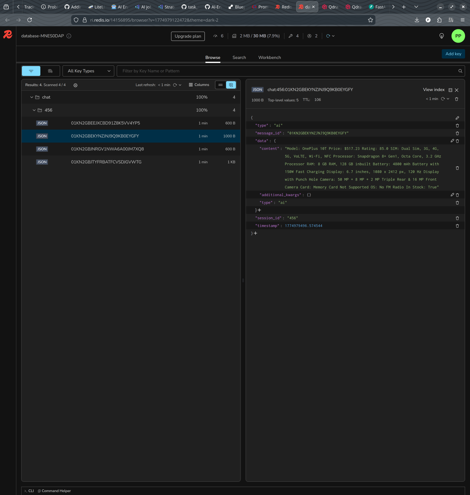
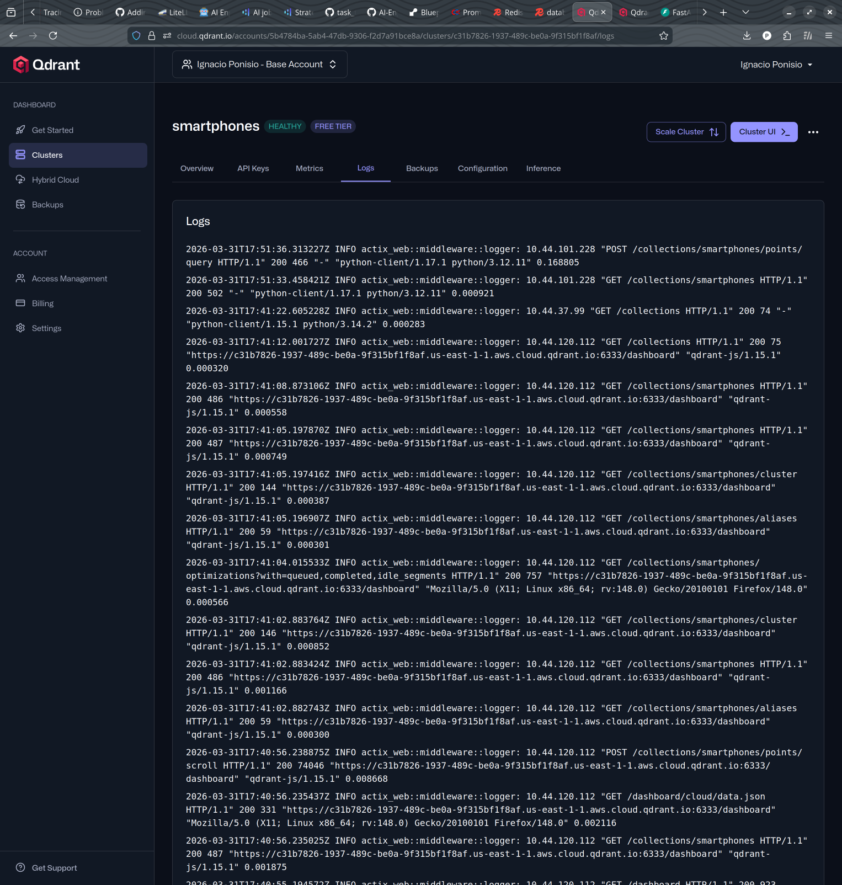
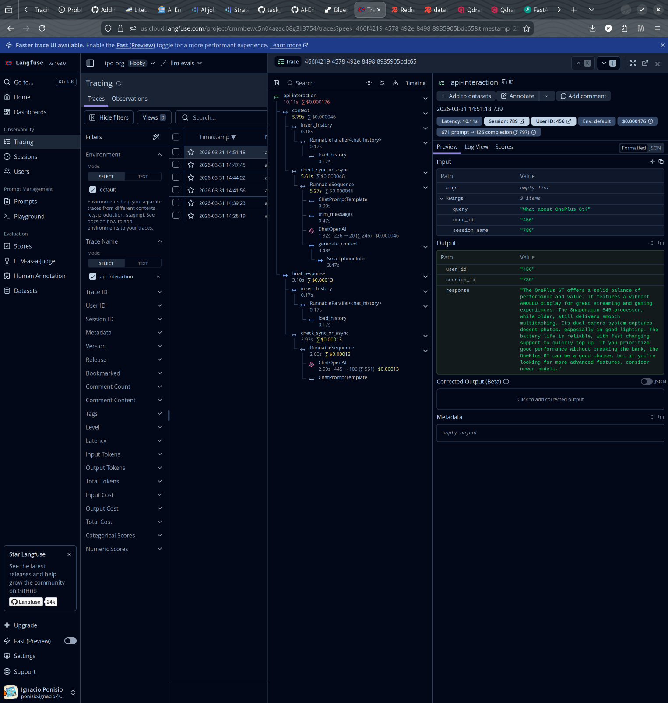
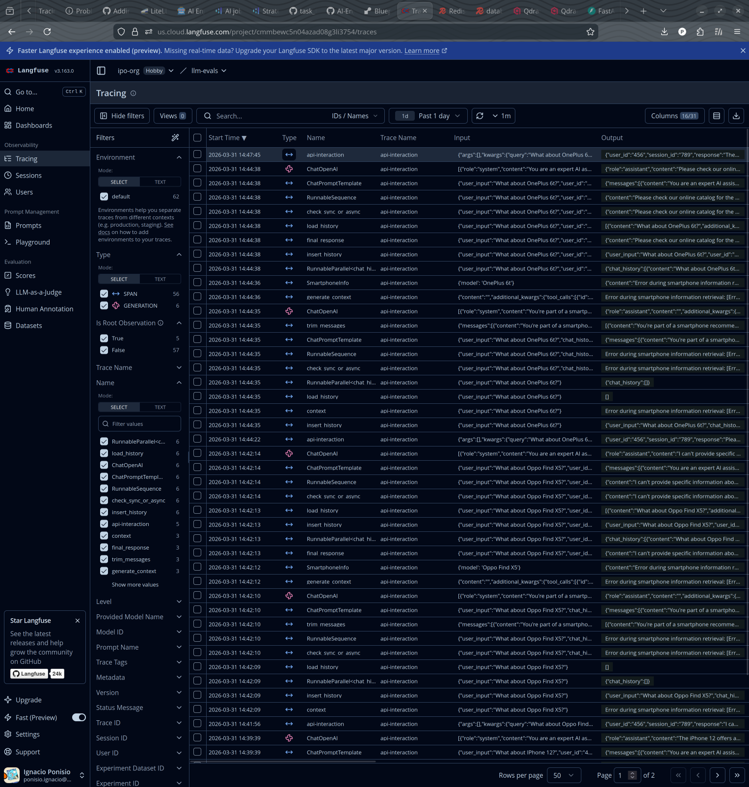

# AI Engineer Deploy - Cloud Services Setup and Run Instructions

## Prerequisites

- Python 3.12+
- [uv](https://docs.astral.sh/uv/) package manager
- Cloud accounts for:
  - [Qdrant Cloud](https://cloud.qdrant.io/)
  - [Redis Cloud](https://redis.io/cloud/)
  - [Langfuse Cloud](https://cloud.langfuse.com/)

## 1. Environment Setup

Copy the environment template and fill in your cloud credentials:

```bash
cp .env.template .env
```

Edit `.env` with your values:

```
OPENAI_MODEL=gpt-4o-mini
OPENAI_API_KEY=<your-openai-api-key>
QDRANT_CONNECTION_URL=<your-qdrant-cloud-url>
QDRANT_API_KEY=<your-qdrant-api-key>
LANGFUSE_SECRET_KEY=<your-langfuse-secret-key>
LANGFUSE_PUBLIC_KEY=<your-langfuse-public-key>
LANGFUSE_HOST=https://cloud.langfuse.com
REDIS_CONNECTION_STRING=redis://<username>:<password>@<public_endpoint>:<port>/0
```

## 2. Install Dependencies

```bash
uv sync
```

## 3. Cloud Services Setup

No local Docker services are required. All external services run in the cloud:

- **Qdrant Cloud** - Create a free tier cluster, generate an API key, and note the endpoint URL. Upload your data by either running the application (which triggers `embed_documents()`) or by uploading a local snapshot via the cluster UI.
- **Redis Cloud** - Create a database and obtain the connection string from the "Connect" dialog (use the Redis CLI connection method with database `0`).
- **Langfuse Cloud** - Create an organization and project, generate public and secret keys, and set `LANGFUSE_HOST` to `https://cloud.langfuse.com`.

## 4. Running the Application

### CLI Mode (`ai-deploy`)

Interactive console-based smartphone assistant with a conversation loop:

```bash
uv run ai-deploy
```

This starts a REPL where you can type queries and receive responses directly in the terminal.

### API Mode (`ask-api`)

REST API served via FastAPI + Uvicorn:

```bash
uv run ask-api
```

The server starts at `http://0.0.0.0:8000`. Send POST requests to the `/ask` endpoint:

```bash
curl -X POST http://localhost:8000/ask \
  -H "Content-Type: application/json" \
  -d '{
    "user_input": "Tell me about the iPhone 15",
    "user_id": "test-user",
    "session_id": "session-001"
  }'
```

## 5. Evidence








